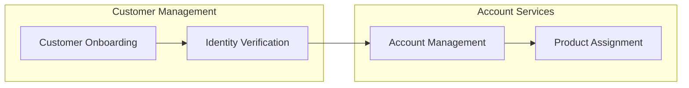
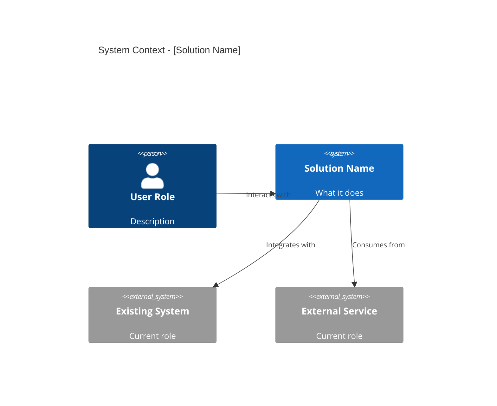

# Feasibility & Impact Assessment Template

Use this template for the output file at `docs/feasibility/YYYY-MM-DD-<topic>-feasibility.md`.

The YAML frontmatter doubles as the **Context Summary** consumed by S3 — Requirements Extraction.

```markdown
---
type: feasibility-assessment
status: draft | review | approved
created: YYYY-MM-DD
concept_brief: [path to S1 output]
# --- Context Summary (consumed by S3) ---
recommendation: proceed | proceed-with-conditions | defer | reject
estimated_size: XS | S | M | L | XL
baseline_duration: [range e.g. "3-6 months"]
ai_assisted_duration: [range e.g. "2-4 months"]
key_risks: [top 3 risk summaries]
conditions: [conditions for proceeding, if any]
change_impact_depth: high-level | detailed
---

# Feasibility & Impact Assessment: [Title]

## Executive Investment Summary
2-3 paragraphs for steering committee. Problem, recommendation,
cost/time range, key risks, conditions. Stands alone — readable
without the rest of the document.

## Feasibility Assessment

### Technical Viability
- Known constraints and integration complexity
- Capability gaps (new technology, skills, infrastructure)
- Areas of particular challenge or novelty
- Confidence level: high | medium | low

#### Business Domain Map (if kept by user)
[Mermaid diagram — business domains and relationships, purely business language]

#### Conceptual System Context (if kept by user)
[Mermaid diagram — solution idea with surrounding systems and actors, business level]

### Financial Justification
- Expected benefits (reference Concept Brief)
- Cost drivers and assumptions

### Organisational Feasibility
- Capacity and resourcing
- Competing priorities
- Skills and knowledge gaps

## ROM Estimate

### Baseline (Traditional Delivery)
| Dimension | T-Shirt Size | Range |
|-----------|-------------|-------|
| Effort | XS/S/M/L/XL | [duration] |
| Cost | XS/S/M/L/XL | [range] |
| Team Size | | [range] |

### AI-Assisted Delivery
| Dimension | T-Shirt Size | Range |
|-----------|-------------|-------|
| Effort | XS/S/M/L/XL | [duration] |
| Cost | XS/S/M/L/XL | [range] |
| Team Size | | [range] |

### AI Opportunity Assessment
| Area | Acceleration Potential | Notes |
|------|----------------------|-------|
| Development velocity | High/Med/Low | [specifics for this initiative] |
| Documentation & analysis | High/Med/Low | [specifics] |
| Testing | High/Med/Low | [specifics] |
| Knowledge acceleration | High/Med/Low | [specifics] |

### AI Limitations & Risks
| Constraint | Impact | Mitigation |
|-----------|--------|------------|
| [e.g. regulatory domain] | [e.g. heavy human review needed] | [approach] |

### Estimate Delta
Summary of difference between baseline and AI-assisted approaches.

## Change Impact Assessment

### Affected Roles & Teams
| Role/Team | Nature of Impact |
|-----------|-----------------|
| [role] | New process / Changed process / New tool / Retired process |

### Process Changes
- [Current process → future process]

### Training Requirements
| Audience | Training Need | Priority |
|----------|--------------|----------|
| [who] | [what] | High/Med/Low |

### Transition Planning Signals (if detailed depth selected)
- Communication needs
- Adoption risks
- Support model changes

## Recommendation
Proceed | Proceed with Conditions | Defer | Reject

### Conditions (if applicable)
- [Condition that must be met before proceeding]

## Open Questions
- [ ] [Unresolved items needing stakeholder input]

## Source Material
References to Concept Brief, existing documentation, and MCP findings.
```

## Contextual Diagram Guidance

### Business Domain Map
Shows business domains/capabilities involved and their relationships. No technology — purely business language.



### Conceptual System Context
Shows the solution idea centrally with business systems and actors around it. C4 Context style but business level.



**Both diagrams are proposed to the user. User reviews each and keeps or discards.**
