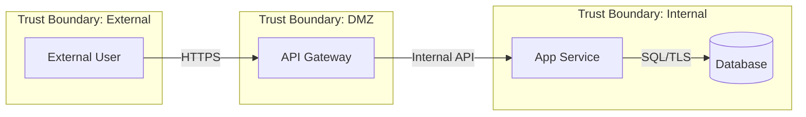

# Threat Model Template

Use this template for the output file at `docs/threat-models/YYYY-MM-DD-<topic>-threat-model.md`.

The YAML frontmatter doubles as the **Context Summary** consumed by S6 and S7.

```markdown
---
type: threat-model
status: draft | review | approved
created: YYYY-MM-DD
architecture: [path to S4]
requirements: [path to S3 v2]
# --- Context Summary (consumed by S6 and S7) ---
component_count: [number of components analysed]
threat_count: [total threats identified]
critical_threats: [count]
high_threats: [count]
medium_threats: [count]
low_threats: [count]
unmitigated_threats: [count of gaps]
asvs_controls_mapped: [count]
security_requirements_count: [new reqs for S3 v3]
---

# Threat Model: [Title]

**Version:** YYYY-MM-DD
**Status:** Draft | Review | Approved
**Architecture:** [Link to S4]
**Methodology:** STRIDE, OWASP ASVS 5.0

## Executive Summary
Overview of threat landscape, key risks, and recommended priorities.

## Scope
### In Scope
Components and data flows included.

### Out of Scope
Exclusions and rationale.

## Data Flow Diagrams

### [Flow Name]
[Mermaid DFD diagram]

**Trust Boundaries:**
- [Boundary description]

## STRIDE Analysis

### [Component/Flow Name]
**Trust Boundary:** [Inside/Outside/Crosses]

| Threat | Category | Scenario | Severity | Mitigation | ASVS Ref |
|--------|----------|----------|----------|------------|----------|
| THR-001 | Spoofing | [scenario] | High | [control] | V2.1.1 |

## Attack Surface
### Entry Points
| Entry Point | Type | Exposure | Controls |
|-------------|------|----------|----------|

### Sensitive Data Stores
| Data Store | Classification | Encryption | Access Control |
|------------|---------------|------------|----------------|

## OWASP ASVS Control Mapping

| Threat | STRIDE | ASVS Requirement | Control | Status |
|--------|--------|------------------|---------|--------|

## Threat Prioritisation

| ID | Threat | Likelihood | Impact | Risk | Priority | Owner |
|----|--------|------------|--------|------|----------|-------|

## Security Requirements Addendum

### New Security Requirements for S3 v3
| ID | Requirement | Source Threat | ASVS Ref |
|----|-------------|---------------|----------|

### Refined Security Requirements
| Original Req | Refinement | Source Threat |
|--------------|------------|---------------|

## Residual Risks
| Threat | Residual Risk | Acceptance Rationale | Review Date |
|--------|--------------|---------------------|-------------|

## Open Questions
- [ ] [Unresolved items]

## Source Material
```

## STRIDE Reference

Apply to each component and data flow:

| Category | Threat Type | Question |
|----------|------------|----------|
| **S** | Spoofing | Can an attacker pretend to be someone/something else? |
| **T** | Tampering | Can an attacker modify data they shouldn't? |
| **R** | Repudiation | Can an attacker deny performing an action? |
| **I** | Information Disclosure | Can an attacker access data they shouldn't? |
| **D** | Denial of Service | Can an attacker disrupt availability? |
| **E** | Elevation of Privilege | Can an attacker gain higher access than intended? |

## Risk Rating

| Likelihood / Impact | High | Medium | Low |
|--------------------|------|--------|-----|
| **High** | Critical | High | Medium |
| **Medium** | High | Medium | Low |
| **Low** | Medium | Low | Low |

## Data Flow Diagram Syntax (Mermaid)


